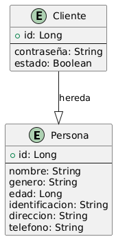

# EcuadorPerson (Personas - Clientes)

## Descripción

EcuadorPerson es un microservicio desarrollado en Spring Boot que gestiona la información de personas y clientes en un sistema bancario. Este servicio permite la creación, modificación y eliminación de registros de personas, así como la administración de clientes que se asocian a cuentas bancarias en el sistema EcuadorCuentaMov.

Esta aplicacion se utiliza con la api de EcuadorCtaMov que se encuentra en el siguiente repositorio:
* https://github.com/julianest/ecuadorCtaMov

## Características Principales
- Creación, actualización y eliminación de cuentas bancarias.
- Registro de movimientos financieros (depósitos y retiros).
- Generación de reportes detallados de transacciones.
- Integración con el servicio **EcuadorPersonas** para validación de clientes.
- Documentación de API con OpenAPI/Swagger.
- Base de datos en memoria H2 para pruebas y desarrollo.
- Despliegue automatizado con Docker y GitHub Container Registry (GHCR).

## Tecnologías Utilizadas
- **Spring Boot** (Web, Data JPA, DevTools)
- **H2 Database** (Base de datos en memoria para pruebas)
- **Lombok** (Para reducir la escritura de código repetitivo)
- **SpringDoc OpenAPI** (Para la documentación de API REST)
- **Mockito, JUnit, Spring RestDocs** (Para pruebas)
- **Docker** (Para la creación de contenedores y despliegue en GHCR)

## Estructura del Proyecto
```
EcuadorPerson/
│── src/
│   ├── main/
│   │   ├── java/com/ecuadorPrueba/ecuador/
│   │   │   ├── config/           # Configuraciones generales
│   │   │   ├── controllers/      # Controladores REST
│   │   │   ├── domains/          # Dominio del negocio
│   │   │   │   ├── entities/      # Entidades JPA
│   │   │   │   ├── dtos/          # Clases DTO para la transferencia de datos
│   │   │   │   ├── repositories/  # Interfaces JPA Repositories
│   │   │   │   ├── services/      # Lógica de negocio y servicios
│   │   │   ├── exceptions/       # Manejo de excepciones personalizadas
│   │   │   ├── utils/            # Utilidades generales
│   │   ├── resources/
│   │   │   ├── application.yml   # Configuración de la aplicación
│   ├── test/
│   │   ├── java/com/ecuadorPrueba/ecuador/  # Pruebas unitarias y de integración
│── pom.xml (Gestión de dependencias con Maven)
```

## Diagrama de Flujo


## MER


## Instalación y Configuración
### Requisitos Previos
- Tener instalado **Java 17** o superior
- Tener **Maven** configurado
- Contar con **Docker** y **Podman** en caso de usar contenedores

### Pasos de Instalación
1. Clonar el repositorio:
   ```sh
   git clone https://github.com/julianest/ecuadorPerson
   cd ecuador
   ```
2. Construir el proyecto con Gradle:
   ```sh
   mvn clean install
   ```
3. Ejecutar la aplicación:
   ```sh
   mvn spring-boot:run
   ```
4. Acceder a la documentación de la API:
    - [Swagger UI](http://localhost:8080/swagger-ui.html)

## Despliegue con Docker
Para crear la imagen y subirla a **GitHub Container Registry (GHCR)**, ejecutar:
```sh
podman build -t ghcr.io/usuario/ecuador:latest .
podman push ghcr.io/usuario/ecuador:latest
```

## Endpoints Principales

# Gestión de Personas
- **GET** `/personas` → Lista todas las personas.
- **GET** `/personas/{id}` → Obtiene una persona por su ID.
- **POST** `/personas` → Crea una nueva persona.
- **PUT** `/personas/{id}` → Actualiza una persona existente.
- **DELETE** `/personas/{id}` → Elimina una persona.

#### Gestión de Clientes
- **GET** `/clientes` → Lista todos los clientes.
- **GET** `/clientes/{id}` → Obtiene un cliente por su ID.
- **POST** `/clientes` → Crea un nuevo cliente.
- **PUT** `/clientes/{id}` → Actualiza un cliente existente.
- **DELETE** `/clientes/{id}` → Elimina un cliente.
### Ejemplo de Petición para Registrar un Movimiento

## Endpoints disponibles
### 1. Crear Clientes
**POST** `/api/clientes`
```json
[
  {
    "identificacion": "1234567890",
    "nombre": "Juan Perez",
    "genero": "Masculino",
    "edad": 30,
    "direccion": "Av. Principal 123",
    "telefono": "0987654321",
    "contraseña": "password123",
    "estado": true
  }
]
```

**Respuesta:**
```json
[
  {
    "id": 1,
    "identificacion": "1234567890",
    "nombre": "Juan Perez",
    "genero": "Masculino",
    "edad": 30,
    "direccion": "Av. Principal 123",
    "telefono": "0987654321",
    "contraseña": "password123",
    "estado": true
  }
]
```

### 2. Obtener Cliente por ID
**GET** `/api/clientes/id/{id}`

**Respuesta:**
```json
{
  "id": 1,
  "identificacion": "1234567890",
  "nombre": "Juan Perez",
  "genero": "Masculino",
  "edad": 30,
  "direccion": "Av. Principal 123",
  "telefono": "0987654321",
  "contraseña": "password123",
  "estado": true
}
```

### 3. Listar todos los clientes
**GET** `/api/clientes`

**Respuesta:**
```json
[
  {
    "id": 1,
    "identificacion": "1234567890",
    "nombre": "Juan Perez",
    "genero": "Masculino",
    "edad": 30,
    "direccion": "Av. Principal 123",
    "telefono": "0987654321",
    "contraseña": "password123",
    "estado": true
  }
]
```

### 4. Actualizar Cliente
**PUT** `/api/clientes/{id}`
```json
{
  "identificacion": "1234567890",
  "nombre": "Juan P. Lopez",
  "genero": "Masculino",
  "edad": 31,
  "direccion": "Av. Nueva 456",
  "telefono": "0999999999",
  "contraseña": "newpass123",
  "estado": true
}
```

**Respuesta:**
```json
{
  "id": 1,
  "identificacion": "1234567890",
  "nombre": "Juan P. Lopez",
  "genero": "Masculino",
  "edad": 31,
  "direccion": "Av. Nueva 456",
  "telefono": "0999999999",
  "contraseña": "newpass123",
  "estado": true
}
```

### 5. Eliminar Cliente
**DELETE** `/api/clientes/{id}`

**Respuesta:**
```json
"Cliente eliminado"
```


### Script BD (SQL)
[script.sql](src/main/resources/script.sql)

### Coleccion Postman 
- [EcuadorPrueba.postman_collection.json](src/main/resources/EcuadorPrueba.postman_collection.json)


## Autor
- **Julian Huerfano** - Desarrollador del proyecto

## Contribuciones
Las contribuciones son bienvenidas. Para colaborar, siga estos pasos:
1. Haga un fork del repositorio
2. Cree una rama con la nueva funcionalidad (`git checkout -b feature-nueva-funcionalidad`)
3. Realice los cambios y haga commit (`git commit -m 'Agregada nueva funcionalidad'`)
4. Envie un pull request

---
Este proyecto es de código abierto y está disponible bajo la licencia MIT.

